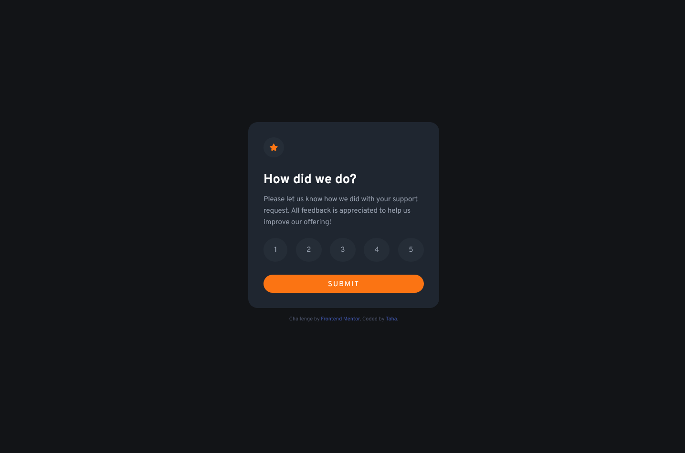
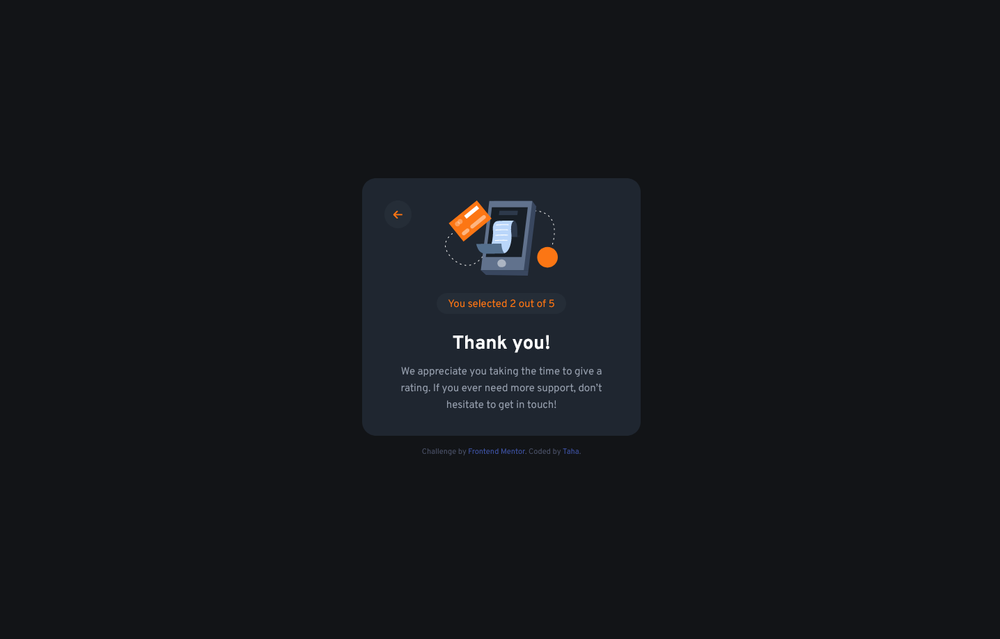
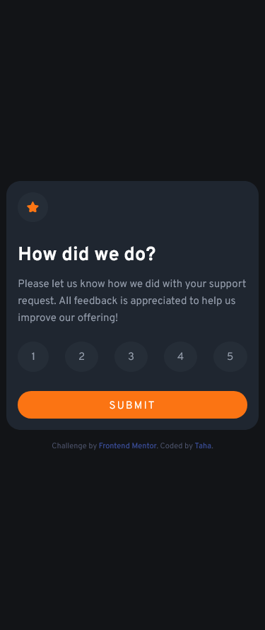

# Frontend Mentor - QR Code Component

This is a solution to the [Interactive Rating Component on Frontend Mentor](https://www.frontendmentor.io/challenges/interactive-rating-component-koxpeBUmI).

## Table of contents

- [Overview](#overview)
- [The challenge](#the-challenge)
- [Screenshots](#screenshots)
- [Links](#links)
- [Built with](#built-with)
- [Author](#author)

## Overview

### The challenge

Users should be able to:

- Select and submit a number rating
- See the "Thank you" card state after submitting a rating
- View the optimal layout for the app depending on their device's - screen size
- See hover states for all interactive elements on the page

### Screenshots

#### Desktop View

#### Mobile View

 
 

### Links

- Solution URL: [Frontend Mentor](https://www.frontendmentor.io/profile/thaykrgl)
- Live Site URL: [Github Pages](https://thaykrgl.github.io/interactive-rating-component/)

## My process

### Built with

- Semantic HTML5 markup
- Mobile-first workflow
- Font Awesome
- Flexbox
- Media Queries
- Google Fonts

## Author

- Linkedin - [Taha](https://www.linkedin.com/in/tahaaykiroglu)
- Frontend Mentor - [@thaykrgl](https://www.frontendmentor.io/profile/thaykrgl)
